# RideOps

Reservation-based campus transportation management platform.

## What is RideOps?

RideOps manages the end-to-end workflow of accessible campus transportation services — the kind operated by university disability services, paratransit offices, and campus mobility programs. It replaces spreadsheets, radio dispatch, and paper logs with a real-time digital platform that connects office dispatchers, drivers, and riders.

Unlike on-demand ride-hailing apps, RideOps is built for the **reservation-based model** that campus transportation programs actually use: riders request rides in advance, office staff approve and schedule them, drivers claim and fulfill assigned rides, and the system tracks every status change, no-show, and shift for reporting. This is dispatch operations software, not a consumer rideshare app.

The platform is **white-label and multi-tenant** — each university gets its own branded experience with custom colors, logos, campus locations, and business rules, all running on a single shared infrastructure. Five campus configurations ship out of the box (USC, Stanford, UCLA, UCI, and a generic default), and adding a new campus takes a configuration file, not a code change.

## Platform Overview

### Three-Role Workflow

| Role | Interface | Purpose |
|------|-----------|---------|
| **Admin** | Desktop console | Approve/deny rides, manage dispatch, monitor drivers, configure settings, run analytics |
| **Driver** | Mobile-optimized view | Clock in/out, claim rides, navigate pickup flow (On My Way → Arrived → Complete/No-Show) |
| **Rider** | Mobile-optimized view | Request rides, view status, manage recurring ride templates, see ride history |

### Multi-Campus Support

Each campus deployment includes branded URLs, school colors, campus-specific locations, and configurable business rules:

| Campus | URL Path | Branded As | Locations |
|--------|----------|------------|-----------|
| USC | `/usc` | USC DART | 304 campus buildings |
| Stanford | `/stanford` | Stanford ATS | 25 campus locations |
| UCLA | `/ucla` | UCLA BruinAccess | 25 campus locations |
| UC Irvine | `/uci` | UCI AnteaterExpress | 25 campus locations |
| Default | `/` | RideOps | 32 generic locations |

Adding a new campus requires only a configuration file with branding, colors, and a locations list. No code changes needed.

### Key Capabilities

**Dispatch & Operations**
- Real-time dispatch board with driver shift bands and ride assignment
- Table and calendar views with multi-filter search
- Service hours enforcement, no-show tracking, configurable grace periods
- Bulk ride management and automated ride lifecycle

**Workforce**
- Weekly shift scheduling (recurring and one-off)
- Driver clock-in/out with tardiness tracking
- Clock-out guards preventing abandonment of active rides

**Fleet**
- Vehicle inventory with standard/accessible type tracking
- Maintenance logging with mileage-at-service history
- Vehicle assignment per ride

**Analytics & Reporting**
- Customizable widget dashboard (29 widgets across Dashboard, Hotspots, and Attendance tabs)
- Ride volume, peak hours, route intelligence, driver performance, rider cohorts
- Multi-sheet Excel export with conditional formatting
- Date range presets including academic period awareness (semester/quarter/trimester)
- Driver and rider milestone tracking with animated progress

**Notifications**
- In-app notification system with per-user, per-event preferences
- Email notifications via SMTP (optional)
- Configurable event types: tardy drivers, rider no-shows, stale rides, new requests

**Rider Safety**
- Consecutive no-show tracking with configurable strike limits
- Automatic service termination and reinstatement workflow
- Rider termination enforced at submission (not just advisory)

## Screenshots

### Admin Console

| Dispatch Board | Analytics Dashboard |
|:---:|:---:|
| 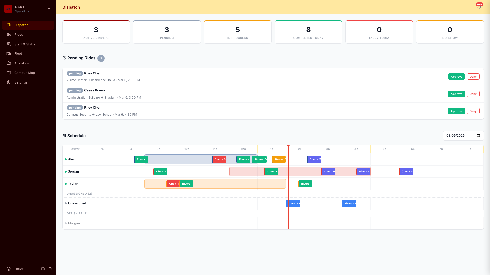 | 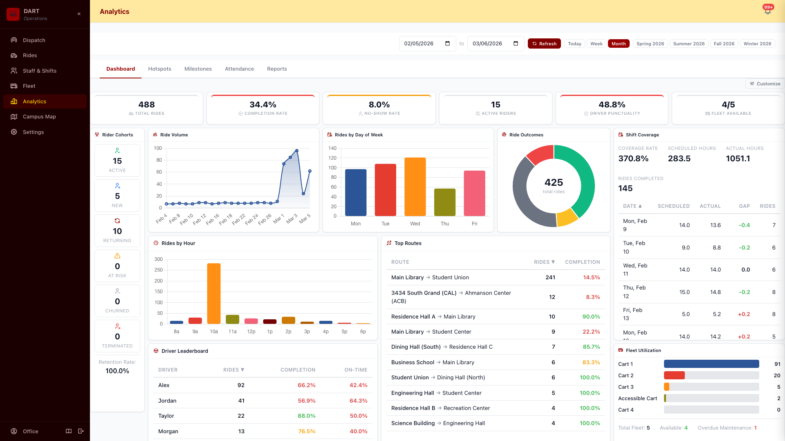 |

| Rides Management | Ride Details |
|:---:|:---:|
| 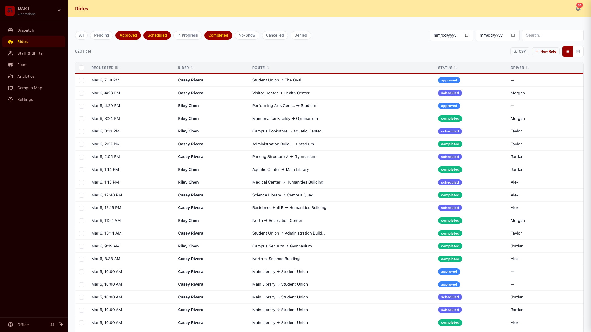 | 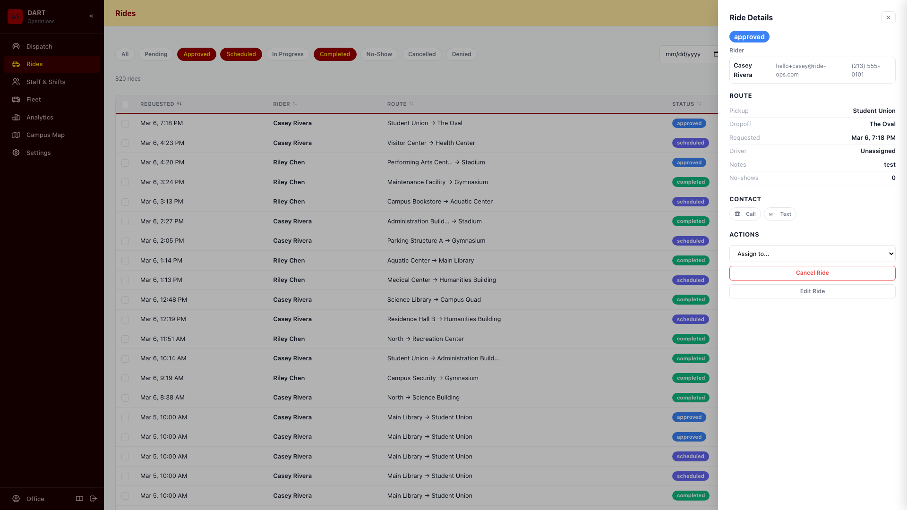 |

| Shift Calendar | Fleet Management |
|:---:|:---:|
| 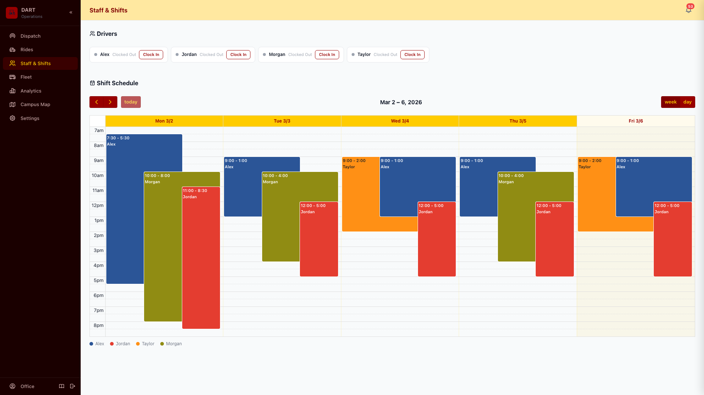 | 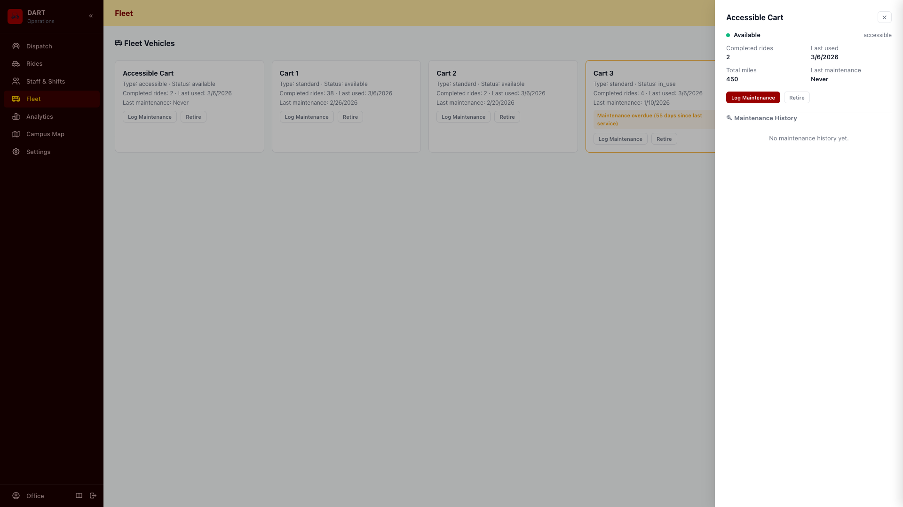 |

### Driver App

| Home (Online) | Grace Timer |
|:---:|:---:|
| 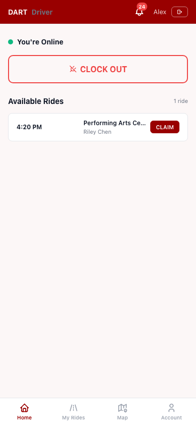 | 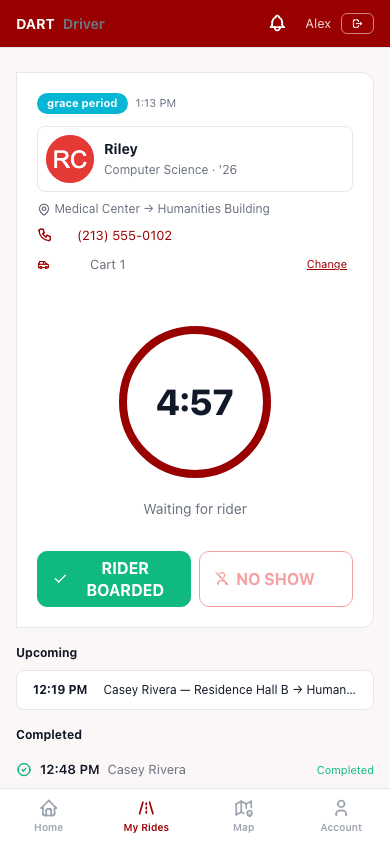 |

### Rider App

| Book a Ride | My Rides |
|:---:|:---:|
| 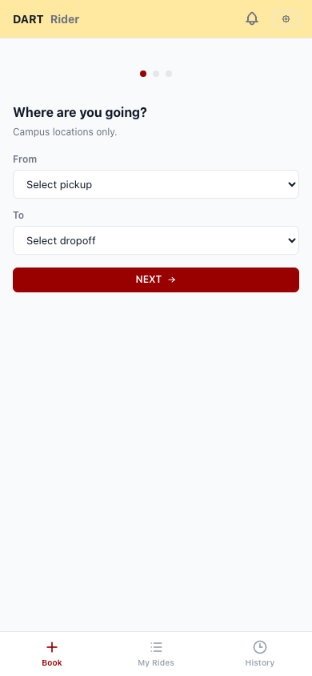 | 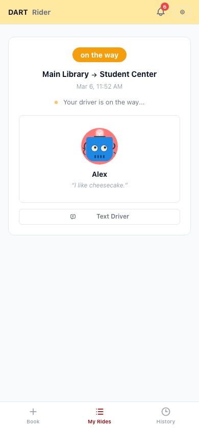 |

### Multi-Campus Theming

Every campus gets its own colors, branding, and locations — no code changes.

| USC | UCLA | Stanford | UCI |
|:---:|:---:|:---:|:---:|
|  | 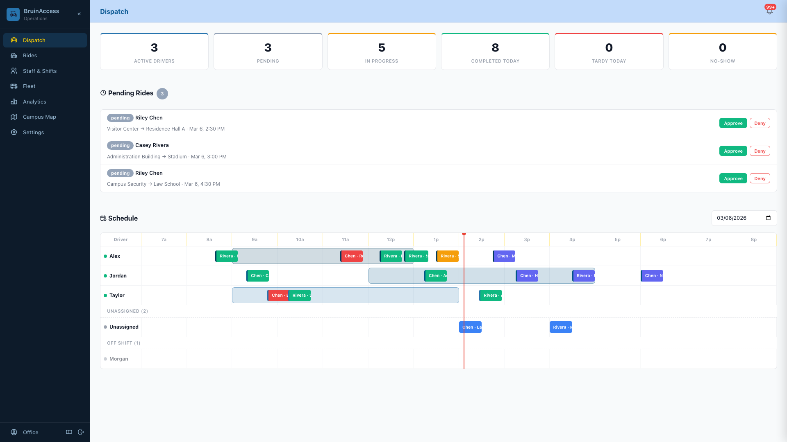 | 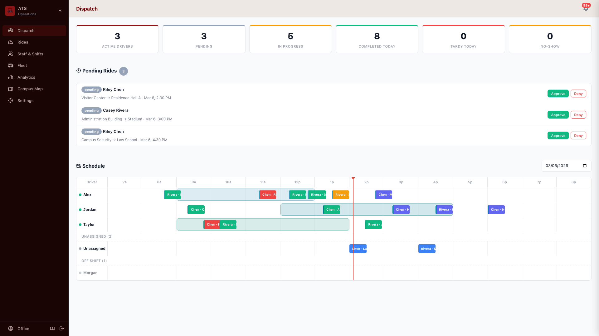 | 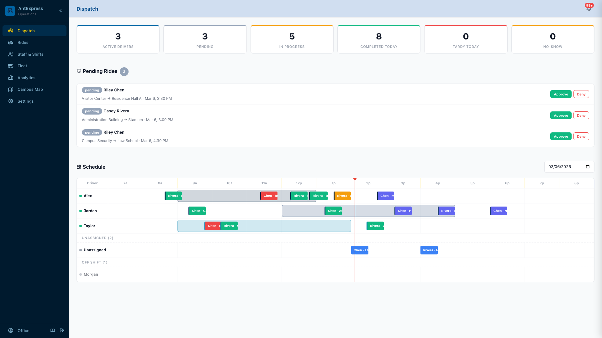 |

<details>
<summary>Full screenshot set (18 views x 4 campuses)</summary>

The `screenshots/` directory contains the complete set — every view rendered across USC, UCLA, Stanford, and UCI. Screenshots are generated via `scripts/take-screenshots.js`.

</details>

## Architecture

### Tech Stack

| Layer | Technology |
|-------|------------|
| Backend | Node.js + Express |
| Database | PostgreSQL with connection pooling |
| Frontend | React 19 + Vite (rider, driver, office consoles) |
| UI Framework | Tabler CSS + Tabler Icons |
| Authentication | Session-based with bcrypt password hashing |
| Session Store | PostgreSQL-backed (connect-pg-simple) |
| Email | Nodemailer with configurable SMTP |
| Reports | ExcelJS for multi-sheet .xlsx generation |
| Charts | Chart.js + react-chartjs-2, react-grid-layout v2 |
| Calendar | FullCalendar with campus-themed driver colors |

### Deployment

RideOps runs as a single Node.js process backed by PostgreSQL. Designed for platform deployment on Railway, Render, Fly.io, or any container host.

- **Health check:** `GET /health` returns database connectivity status
- **Graceful shutdown:** SIGTERM/SIGINT handlers drain connections (15s timeout)
- **Startup recovery:** Rides stuck in transient states are automatically recovered on restart
- **Configuration:** All settings via environment variables — no config files required for deployment
- **Vite build:** `npm run build` compiles React apps to `client/dist/`, served as static files

### Security

See [`docs/reference/SECURITY.md`](docs/reference/SECURITY.md) for the full security overview.

- Session-based authentication with async bcrypt password hashing
- PostgreSQL-backed session store (connect-pg-simple) — no in-memory session data
- Rate limiting on authentication endpoints (login: 10 req/15min, signup: 5 req/15min)
- Parameterized SQL queries across all 99 API endpoints — no string interpolation
- XSS sanitization on user-generated content (event handler and protocol stripping)
- Role-based access control: office, staff (office + driver), rider
- Secure cookie configuration in production (HttpOnly, Secure, SameSite)
- Input validation on all user-facing endpoints with server-side enforcement
- Transaction-wrapped multi-step operations (no-show, completion, cancellation)

### Data Privacy

- All data stored in PostgreSQL with connection encryption support
- No third-party analytics, tracking pixels, or external data sharing
- Configurable data retention policies with automated purge of terminal rides
- Session data stored server-side only — cookies contain only session ID
- Passwords stored as bcrypt hashes (async, cost factor 10)
- FERPA-aligned data handling practices (formal compliance documentation available on request)

### Accessibility

- Tabler CSS framework provides WCAG-aligned component library
- Semantic HTML structure across all views
- Keyboard-navigable interfaces
- Mobile-responsive design for driver and rider views (optimized for field use)
- High-contrast status colors for ride lifecycle states
- Full VPAT/Section 508 audit planned

## Getting Started

### Prerequisites

- Node.js >= 18.0.0 (see `.nvmrc`)
- PostgreSQL 14+

### Installation

```bash
git clone <repository-url>
cd RideOps
npm install
node server.js
```

Server starts on `http://localhost:3000`.

### Configuration

| Variable | Default | Description |
|----------|---------|-------------|
| `PORT` | `3000` | Server port |
| `DATABASE_URL` | `postgres://localhost/rideops` | PostgreSQL connection string |
| `SESSION_SECRET` | _(auto-generated)_ | Session encryption key (**required in production**) |
| `NODE_ENV` | `development` | Set to `production` for secure cookies and strict validation |
| `TENANT_FILE` | _(none)_ | Path to tenant JSON config file |
| `DEMO_MODE` | `false` | Enable demo mode with seeded sample data |
| `DISABLE_RIDER_SIGNUP` | `false` | Disable public rider self-registration |
| `SMTP_HOST` | _(none)_ | SMTP server hostname (optional — falls back to console logging) |
| `SMTP_PORT` | `587` | SMTP port |
| `SMTP_USER` | _(none)_ | SMTP authentication username |
| `SMTP_PASS` | _(none)_ | SMTP authentication password |
| `NOTIFICATION_FROM` | `noreply@ride-ops.com` | Notification sender email address |
| `NOTIFICATION_FROM_NAME` | `RideOps` | Notification sender display name |

### Demo Mode

```bash
DEMO_MODE=true node server.js
```

Seeds 650+ historical rides across 5 weeks, driver shifts with clock events, recurring ride templates, fleet vehicles, and notifications. Access the demo role picker at `/demo`.

<details>
<summary>Demo credentials</summary>

All accounts use password `demo123`:
- **Admin:** `office`
- **Drivers:** `alex`, `jordan`, `taylor`, `morgan`
- **Riders:** `casey`, `riley`

</details>

### Org-Scoped URLs

Each campus has dedicated URL paths with automatic branding:

```
/usc              → USC DART office console
/usc/driver       → USC DART driver view
/usc/rider        → USC DART rider booking
/usc/signup       → USC DART rider registration

/stanford         → Stanford ATS office console
/ucla             → UCLA BruinAccess office console
/uci              → UCI AnteaterExpress office console
```

Legacy routes (`/office`, `/driver`, `/rider`) work with default RideOps branding.

### Tenant Configuration

Load organization-specific branding, locations, and business rules:

```bash
TENANT_FILE=tenants/usc-dart.json node server.js
```

Tenant configs define: org name, colors, tagline, campus map URL, location list, member ID field format, and program rules.

## Development

### Project Structure

```
server.js                     Thin orchestrator (~310 lines)
lib/                          Backend modules (config, db, helpers, auth-middleware)
routes/                       15 route modules (auth, rides, analytics, etc.)
email.js                      Email sending with tenant-aware branding
notification-service.js       Notification dispatch engine
demo-seed.js                  Demo data seeder

client/
  src/rider/                  React rider app
  src/driver/                 React driver app
  src/office/                 React office/admin console
  src/components/             Shared React components
  src/contexts/               Auth, Tenant, Toast contexts
  src/hooks/                  Shared hooks (usePolling, useRides, etc.)
  dist/                       Built output (served via /app/)

public/
  login.html / signup.html    Authentication pages
  demo.html                   Demo mode role picker
  css/rideops-theme.css       Design system (CSS custom properties)
  campus-themes.js            Per-campus color palettes
  vendor/                     Vendored CSS/JS (Tabler, FullCalendar)

tenants/
  campus-configs.js           Campus branding definitions
  usc-dart.json               USC DART tenant config
  *-locations.js              Campus location lists (25-304 per campus)

screenshots/                  Platform screenshots (18 views x 4 campuses)
```

### Database

PostgreSQL with 14 tables. Schema auto-initializes on first startup — no manual migration step. See `db/schema.sql` for the full schema.

### API

99 REST endpoints organized by domain: authentication, rides, employees, shifts, vehicles, analytics, settings, notifications, and admin. Full API documentation is maintained in `CLAUDE.md`.

## License

Proprietary. All rights reserved.
